# CAMPUSCLUBOS - ENTITY RELATIONSHIP DIAGRAM (ERD)

```mermaid
erDiagram
    USERS ||--o| FACULTY : "extends (user_id)"
    USERS ||--o| STUDENTS : "extends (user_id)"
    FACULTY ||--o{ STUDENTS : "mentors (class_mentor_id)"
    USERS ||--o{ CLUBS : "creates (created_by)"
    USERS ||--o| CLUBS : "manages (club_admin_id)"
    CLUBS ||--o{ CLUB_COORDINATORS : "supervised_by"
    FACULTY ||--o{ CLUB_COORDINATORS : "assigned_to (faculty_user_id)"
    CLUBS ||--o{ CLUB_ROLES : "defines"
    CLUB_ROLES ||--o{ CLUB_ROLE_PERMISSIONS : "grants"
    PERMISSIONS ||--o{ CLUB_ROLE_PERMISSIONS : "assigned_to"
    CLUBS ||--o{ CLUB_MEMBERSHIPS : "has_members"
    USERS ||--o{ CLUB_MEMBERSHIPS : "joins"
    CLUB_ROLES ||--o{ CLUB_MEMBERSHIPS : "holds_role"
    
    USERS ||--o{ TIMETABLES : "creates (created_by)"
    TIMETABLES ||--o{ TIMETABLE_WORKING_DAYS : "applies_to_days"
    TIMETABLES ||--o{ TIMETABLE_PERIODS : "contains_periods"
    
    CLUBS ||--o{ EVENTS : "organizes"
    USERS ||--o{ EVENTS : "creates (created_by)"
    USERS ||--o{ EVENTS : "escalates (escalated_by)"
    EVENTS ||--o{ EVENT_REGISTRATIONS : "has_registrations"
    STUDENTS ||--o{ EVENT_REGISTRATIONS : "registers (student_user_id)"
    
    EVENTS ||--o{ ATTENDANCE : "tracks"
    STUDENTS ||--o{ ATTENDANCE : "marked_for (student_user_id)"
    USERS ||--o{ ATTENDANCE : "marked_by"
    
    EVENT_REGISTRATIONS ||--o{ OD_REQUESTS : "requests_od_for"
    STUDENTS ||--o{ OD_REQUESTS : "applies (student_user_id)"
    FACULTY ||--o{ OD_REQUESTS : "reviews (class_mentor_id/reviewed_by)"
    OD_REQUESTS ||--o{ OD_REQUEST_PERIODS : "snapshots_periods"
    TIMETABLES ||--o{ OD_REQUEST_PERIODS : "references_structure"
    
    EVENTS ||--o{ CERTIFICATES : "issued_for"
    STUDENTS ||--o{ CERTIFICATES : "awarded_to (student_user_id)"
    USERS ||--o{ CERTIFICATES : "issued_by"
    
    CLUBS ||--o{ BADGES : "defines"
    BADGES ||--o{ STUDENT_BADGES : "awarded_as"
    STUDENTS ||--o{ STUDENT_BADGES : "holds_badge (student_user_id)"
    USERS ||--o{ STUDENT_BADGES : "awarded_by"
    
    USERS ||--o{ NOTIFICATIONS : "receives"
    COMMUNICATION_THREADS ||--o{ THREAD_PARTICIPANTS : "includes"
    USERS ||--o{ THREAD_PARTICIPANTS : "participates"
    COMMUNICATION_THREADS ||--o{ MESSAGES : "contains"
    USERS ||--o{ MESSAGES : "sends"
    USERS ||--o{ AUDIT_LOGS : "acts (actor_id)"
```

## Entity Details: CERTIFICATES & Revocation
- `status`: `ISSUED`, `REVOKED`
- `role_type`: `PARTICIPANT`, `WINNER`, `RUNNER_UP`, `VOLUNTEER`, `ORGANIZER`
- `revocation_reason`, `revoked_by`, `revoked_at`: Populated when certificate is revoked by Club Admin or Super Admin.

