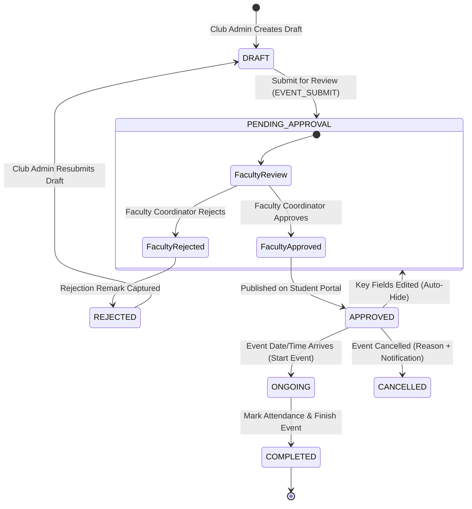
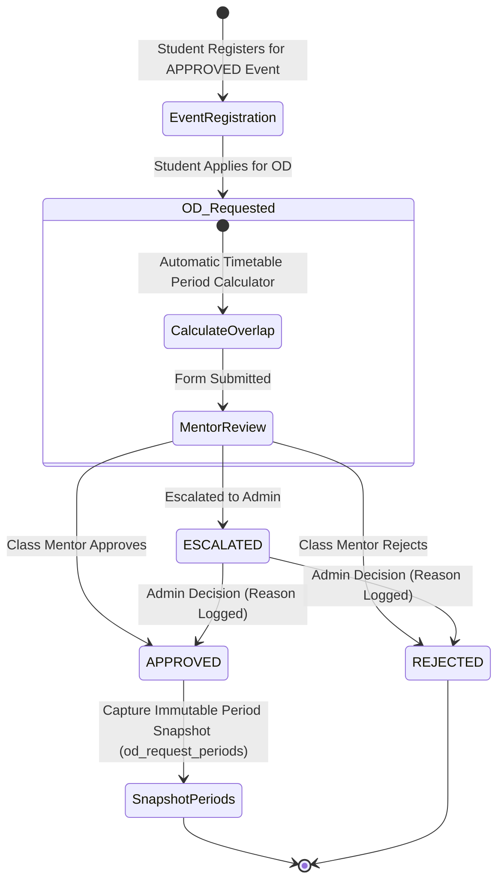
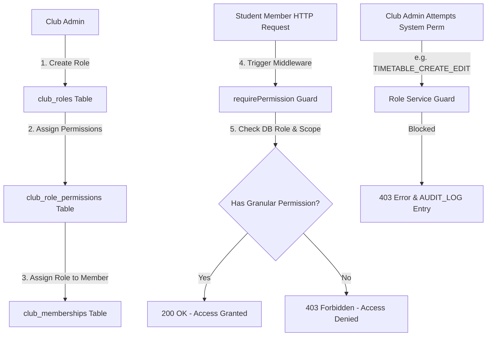
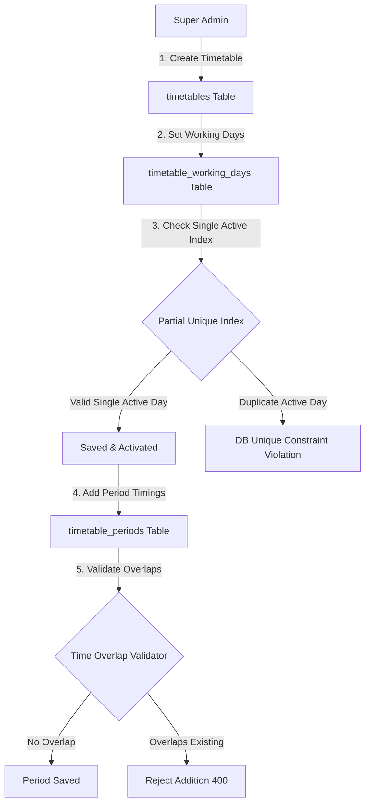
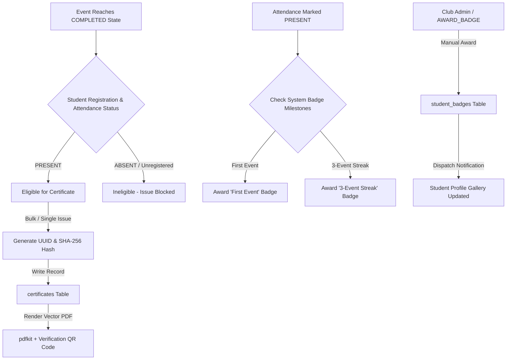

# CampusClubOS - System Workflow Diagrams

This document contains the 5 primary Mermaid workflow diagrams representing the core operational state machines and permission gates in **CampusClubOS**.

---

## 1. Event Approval Gate & Lifecycle Flow

---

## 2. Student On-Duty (OD) Processing Flow

---

## 3. Dynamic Club Role & RBAC Flow

---

## 4. Master Timetable Structure Flow

---

## 5. Certificate Issuance & Badge Awarding Flow

